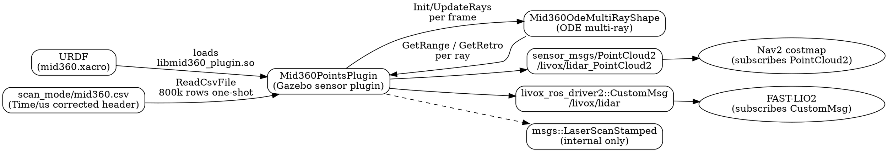
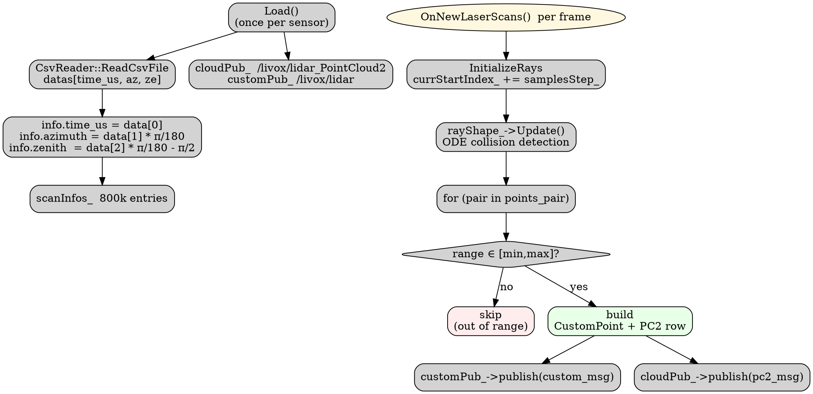

# Mid-360 Lidar Simulation Upgrade — Design Spec

**Date**: 2026-08-05
**Author**: Brainstorming session with user
**Status**: Design approved — awaiting implementation plan
**Target package**: `robots/mid360_simulation`
**Reference repo (read-only)**: `tmp/livox_laser_simulation_RO2` (LihanChen2004/livox_laser_simulation_ros2 fork)

---

## 1. Background and Goals

### 1.1 Problem statement

The current `mid360_simulation` Gazebo plugin publishes only one ROS message type —
`sensor_msgs/msg/PointCloud2` to `/livox/lidar`. Downstream consumers (FAST-LIO2, future
Nav2 costmap layers) require `livox_ros_driver2/msg/CustomMsg` for LIO compatibility.
Adding a second ROS topic that emits CustomMsg removes the need for runtime conversion
nodes.

Additionally, three correctness bugs were identified during exploration:

1. **CSV header mislabel**: `scan_mode/mid360.csv` declares `Time/s` but the data is in
   microseconds (1..800000). The current code uses the value as seconds, producing a
   per-point timestamp offset of ~800 000 seconds inside PointCloud2's `timestamp`
   field — visibly wrong to the user.
2. **Constant intensity**: PointCloud2 hardcodes `intensity = 100.0f` instead of reading
   the ray's laser retro value from ODE.
3. **Reference repo bugs** (to *avoid* when porting logic, not to copy):
   - `header.stamp = node_->get_clock()->now()` falls back to wall-clock when
     `use_sim_time:=true` is not declared in the launch (which our launches do not).
   - `offset_time` is measured as loop-iteration wall-clock nanoseconds, not the
     physical intra-frame scan time — semantically wrong for LIO.
   - `clouds.emplace_back()` is duplicated inside the for-loop, doubling PointCloud2
     point counts.

### 1.2 Goals

- Single Gazebo plugin emits **both** CustomMsg and PointCloud2 from one shared scan loop
  (no double conversion in downstream nodes).
- CustomMsg → `/livox/lidar` (FAST-LIO2 default topic)
- PointCloud2 → `/livox/lidar_PointCloud2` (Nav2 / costmap consumers)
- `header.stamp` derived from `world->SimTime()` so timestamps are reproducible across
  pause / resume / `real_time_factor` changes.
- CustomMsg `offset_time` is intra-frame nanoseconds, monotonic, uint32 — directly
  compatible with FAST-LIO2's `curvature = offset_time / 1e6` formula.
- PointCloud2 carries 6 fields (x, y, z, intensity, ring, timestamp) for Nav2 costmap
  compatibility, with safe 32-byte point_step alignment.

### 1.3 Non-goals

- No rewrite of the ODE multi-ray shape (`Mid360OdeMultiRayShape` already behaves correctly).
- No changes to URDF, launch files, package name, or plugin filename.
- No git submodule / install script for `livox_ros_driver2` — dependency is documented
  in `mid360_simulation/README.md` only.
- No new GitHub fork; reference repo (`tmp/livox_laser_simulation_RO2`) remains
  read-only inspiration and is not vendored.

---

## 2. Architecture

### 2.1 System view



### 2.2 Single-plugin, dual-publish design

The existing `Mid360PointsPlugin::OnNewLaserScans()` already iterates a single
`points_pair` (ray index, RotateInfo) vector. The upgrade reuses this loop verbatim and
appends both a `CustomPoint` and a PointCloud2 row from each successful ray hit. There
is **no second loop** — both messages are derived from the same ODE collision result.



---

## 3. Component and File Changes

### 3.1 Files modified

| File | Change | Summary |
|------|--------|---------|
| `robots/mid360_simulation/include/mid360_simulation/mid360_points_plugin.h` | edit | Add `#include <livox_ros_driver2/msg/custom_msg.hpp>`; declare `customPub_`; add `point_step_` constant |
| `robots/mid360_simulation/src/mid360_points_plugin.cpp` | edit | Publish CustomMsg; rebuild PointCloud2 with 6 fields; fix CSV unit interpretation; read `GetRetro` for intensity/reflectivity; ensure `cloudPub_` topic uses `_PointCloud2` suffix |
| `robots/mid360_simulation/scan_mode/mid360.csv` | edit | First line: `Time/s,Azimuth/deg,Zenith/deg` → `Time/us,Azimuth/deg,Zenith/deg` (data unchanged) |
| `robots/mid360_simulation/CMakeLists.txt` | edit | `find_package(livox_ros_driver2 REQUIRED)`; add to `ament_target_dependencies` |
| `robots/mid360_simulation/package.xml` | edit | Add `<depend>livox_ros_driver2</depend>` |
| `robots/mid360_simulation/README.md` | edit | Update topic table (split CustomMsg vs PointCloud2); add `livox_ros_driver2` install steps; document manual `CMAKE_PREFIX_PATH` convention |

### 3.2 Files unchanged

- `include/mid360_simulation/mid360_ode_multiray_shape.{h,cpp}` — ODE shape already correct
- `include/mid360_simulation/csv_reader.hpp` — parser is generic; not changed
- All URDF xacro files (`robot_scene/xacro/*.xacro`)
- All launch files (`robot_scene/launch/*.launch.py`) — `GAZEBO_PLUGIN_PATH` already
  points to `install/mid360_simulation/lib`; the plugin filename `libmid360_plugin.so`
  is unchanged

### 3.3 Header diff (`mid360_points_plugin.h`)

```cpp
// New include (top of file)
#include <livox_ros_driver2/msg/custom_msg.hpp>

// New private member (in the private section, alongside cloudPub_)
rclcpp::Publisher<livox_ros_driver2::msg::CustomMsg>::SharedPtr customPub_;

// New constants (file scope)
static constexpr std::size_t kPointStepBytes = 32;  // see §4.2
static constexpr uint8_t    kMid360Tag       = 0x10;  // normal single-echo (FAST-LIO accept)
static constexpr uint8_t    kMid360Line      = 0;     // mid360 is single-line scan
```

### 3.4 `Load()` diff (additive only — existing code preserved)

```cpp
// Existing: cloudPub_ topic name change
//   Before:  cloudPub_ = rosNode_->create_publisher<sensor_msgs::msg::PointCloud2>(
//                curr_scan_topic, 10);
//   After:   cloudPub_ = rosNode_->create_publisher<sensor_msgs::msg::PointCloud2>(
//                curr_scan_topic + "_PointCloud2", 10);
//
// New: CustomMsg publisher
customPub_ = rosNode_->create_publisher<livox_ros_driver2::msg::CustomMsg>(
    curr_scan_topic, 10);
```

### 3.5 `OnNewLaserScans()` — main rewrite

Pseudocode of the new body (replaces the existing PointCloud2-only loop):

```cpp
const auto& gz_sim_time = world->SimTime();
const double sim_time_sec = gz_sim_time.Double();

// --- CustomMsg skeleton ---
livox_ros_driver2::msg::CustomMsg custom_msg;
custom_msg.header.frame_id = raySensor_->Name();
custom_msg.header.stamp    = ToRosTime(gz_sim_time);   // builtin_interfaces::Time
custom_msg.timebase        = 0;
custom_msg.lidar_id        = 0;
custom_msg.points.reserve(points_pair.size());

// --- PointCloud2 skeleton ---
sensor_msgs::msg::PointCloud2 pc2;
pc2.header = custom_msg.header;            // same stamp + frame
pc2.height = 1;
pc2.is_dense = true;
pc2.is_bigendian = false;
SetPointCloud2Fields(pc2);                // see §4.2
std::vector<uint8_t> pc2_buf;
pc2_buf.reserve(points_pair.size() * kPointStepBytes);

// --- Single shared loop ---
for (const auto& pair : points_pair) {
  const double range = rayShape_->GetRange(pair.first);
  if (range >= maxDist_ || range <= minDist_) continue;        // discard

  const double retro = rayShape_->GetRetro(pair.first);        // [0,1]
  const auto& info   = pair.second;                            // RotateInfo

  // Geometry
  ignition::math::Quaterniond q;
  q.Euler(ignition::math::Vector3d(0.0, info.zenith, info.azimuth));
  const auto axis = q * ignition::math::Vector3d(1, 0, 0);
  const auto p    = range * axis;

  // --- CustomPoint ---
  livox_ros_driver2::msg::CustomPoint cp;
  cp.offset_time  = static_cast<uint32_t>(info.time_us * 1000.0);  // μs → ns
  cp.x = static_cast<float>(p.X());
  cp.y = static_cast<float>(p.Y());
  cp.z = static_cast<float>(p.Z());
  cp.reflectivity = static_cast<uint8_t>(std::clamp(retro * 255.0, 0.0, 255.0));
  cp.tag          = kMid360Tag;
  cp.line         = kMid360Line;
  custom_msg.points.push_back(cp);

  // --- PointCloud2 row ---
  const float    intensity   = cp.reflectivity;
  const uint16_t ring        = 0;
  const double   point_abs_t = sim_time_sec + info.time_us * 1e-6;
  AppendPc2Row(pc2_buf, cp.x, cp.y, cp.z, intensity, ring, point_abs_t);
}

custom_msg.point_num = static_cast<uint32_t>(custom_msg.points.size());
customPub_->publish(custom_msg);

pc2.width     = custom_msg.point_num;
pc2.row_step  = pc2.width * pc2.point_step;
pc2.data      = std::move(pc2_buf);
cloudPub_->publish(pc2);
```

`ToRosTime`, `SetPointCloud2Fields`, `AppendPc2Row` are private helper functions
defined in the same `.cpp`.

---

## 4. Field Definitions

### 4.1 CustomMsg / CustomPoint fields

| Field | Type | Value source | Notes |
|-------|------|--------------|-------|
| `header.stamp` | `builtin_interfaces/Time` | `world->SimTime()` | Reproducible across `real_time_factor` / pause / resume |
| `header.frame_id` | `string` | `raySensor_->Name()` | Unchanged from current |
| `timebase` | `uint64` | `0` | Livox internal timestamp base; not used by FAST-LIO2 |
| `point_num` | `uint32` | `custom_msg.points.size()` | Count after filtering |
| `lidar_id` | `uint8` | `0` | Single-lidar setup |
| `points[i].offset_time` | `uint32` | `static_cast<uint32_t>(info.time_us * 1000.0)` | μs → ns; intra-frame; monotonic in scan order |
| `points[i].x` / `.y` / `.z` | `float32` | ODE ray endpoint in sensor frame | Unchanged semantics |
| `points[i].reflectivity` | `uint8` | `clamp(retro * 255, 0, 255)` | Was hardcoded to `100.0f` in old PointCloud2; reference repo left it zero |
| `points[i].tag` | `uint8` | `0x10` | FAST-LIO2 filter: `(tag & 0x30) == 0x10` |
| `points[i].line` | `uint8` | `0` | mid360 is single-line scan |

### 4.2 PointCloud2 fields (32-byte aligned)

```
offset  type     name        bytes
──────────────────────────────────────
0       FLOAT32  x           4
4       FLOAT32  y           4
8       FLOAT32  z           4
12      FLOAT32  intensity   4
16      UINT16   ring        2
18      padding  -           6      ← alignment for FLOAT64
24      FLOAT64  timestamp   8
──────────────────────────────────────
point_step = 32
```

`timestamp` = `sim_time_sec + info.time_us * 1e-6` — the absolute simulation time at
which the ray physically swept the point. (Both absolute and intra-frame are encoded
elsewhere; absolute is the more useful one for Nav2's time-synchronization layers.)

Helper `SetPointCloud2Fields`:

```cpp
void Mid360PointsPlugin::SetPointCloud2Fields(sensor_msgs::msg::PointCloud2& pc) {
  pc.fields.resize(6);
  pc.fields[0] = MakeField("x",         0,  sensor_msgs::msg::PointField::FLOAT32);
  pc.fields[1] = MakeField("y",         4,  sensor_msgs::msg::PointField::FLOAT32);
  pc.fields[2] = MakeField("z",         8,  sensor_msgs::msg::PointField::FLOAT32);
  pc.fields[3] = MakeField("intensity", 12, sensor_msgs::msg::PointField::FLOAT32);
  pc.fields[4] = MakeField("ring",      16, sensor_msgs::msg::PointField::UINT16);
  pc.fields[5] = MakeField("timestamp", 24, sensor_msgs::msg::PointField::FLOAT64);
  pc.point_step = 32;
}
```

Helper `AppendPc2Row` does the bytewise append (use `std::memcpy` for endianness clarity,
or write through a `struct __attribute__((packed))` POD — preferred for readability).

---

## 5. Invariants

1. **Single time source**: every stamp in the plugin comes from `world->SimTime()`. No
   `boost::chrono` / `std::chrono::steady_clock` / `node_->get_clock()->now()` is allowed
   for scan-time semantics.
2. **Shared loop guarantee**: `custom_msg.point_num == pc2.width` for any frame where
   the loop runs. There is exactly one for-loop over `points_pair`; both messages are
   produced from the same iteration.
3. **Monotonic offset_time**: `info.time_us` is monotonic in `points_pair` because the
   for-loop walks `currStartIndex_` upward. So `points[i].offset_time` is monotonic
   within the frame (matching FAST-LIO2's expectation).
4. **CSV unit unambiguous**: the CSV header explicitly says `Time/us`. The reader no
   longer pretends the column is seconds.
5. **Out-of-range rays are dropped, not zero-ranged**: a ray with `range >= maxDist_ ||
   range <= minDist_` is skipped entirely; no zero-distance phantom points appear in
   either message.

---

## 6. Error Handling

| Failure | Detection | Behavior |
|---------|-----------|----------|
| CSV file cannot be opened | `CsvReader::ReadCsvFile` returns false | `RCLCPP_ERROR` log; return from `Load()`; plugin stays in "no-op" state (consistent with current behavior) |
| `livox_ros_driver2` not installed | `find_package` fails at CMake time | Build fails — surface error to maintainer |
| Publisher creation fails | ROS2 throws on construction | Gazebo aborts plugin load (matches current behavior) |
| All rays out of range in a frame | Loop produces empty `points` / `pc2.data` | Still publish — `point_num = 0`, `width = 0` — to avoid subscriber starvation |
| `retro > 1.0` (some Gazebo builds return >1) | Numeric check in helper | `std::clamp` to `[0, 255]` |

---

## 7. Testing Strategy

| Level | Tool | Verification |
|-------|------|--------------|
| Build | `colcon build --packages-select mid360_simulation --cmake-clean-cache` | Compiles cleanly, no warnings under `-Wall -Wextra -Wpedantic` (already set in CMakeLists) |
| Format | `clang-format -i src/*.cpp include/**/*.hpp` then `clang-format --dry-run --Werror` | Matches repo style |
| Lint | `clang-tidy src/*.cpp -- -std=c++17` | No high-priority issues |
| Unit | GoogleTest, `test/test_pointcloud2_layout.cpp` | (a) PC2 field offsets/sizes match §4.2; (b) `offset_time` monotonic across a 1000-row fixture; (c) `point_num == width` invariant |
| Integration | `ros2 launch robot_scene go2w_lidar_gps.launch.py` + `ros2 bag record /livox/lidar /livox/lidar_PointCloud2` | Both topics publish at the same rate; RViz shows identical point clouds from both topics |
| LIO end-to-end | `ros2 launch fastlio2 lio_launch.py` while Gazebo runs | FAST-LIO2 receives CustomMsg, fills `m_state_data.lidar_buffer`, and progresses past `syncPackage()`; no `Lidar Message is out of order` warning |

Coverage target: 80%+ on `mid360_points_plugin.cpp` (per repo testing rule).

---

## 8. Risks and Mitigations

| Risk | Likelihood | Impact | Mitigation |
|------|-----------|--------|------------|
| Ring + timestamp padding miscomputed, downstream PointCloud2 readers fail | Low | Medium | 32-byte aligned layout; unit test asserts offsets |
| `livox_ros_driver2` not findable in another user's CMake prefix path | High (different devs) | Medium | Document manual `CMAKE_PREFIX_PATH` in README; not auto-persisted |
| `points.push_back` reallocations cause per-frame jitter | Low | Low | `reserve(scanInfos_.size())` at construction time |
| Existing PointCloud2 subscribers on `/livox/lidar` (LEGO-LOAM) silently break | High | High | Document new topic name `_PointCloud2` prominently; LEGO-LOAM is out-of-scope for this repo's downstream (user switched to FAST-LIO2) |
| CSV header change breaks a downstream script that grep'd "Time/s" | Very low | Low | Comment in `csv_reader.hpp` near unit description |

---

## 9. Development Workflow

### 9.1 Prerequisites

- ROS2 Humble installed system-wide (`/opt/ros/humble`)
- `livox_ros_driver2` already built at:
  `/media/lenovo/disk/planner_ws/src/Nav3D/install/livox_ros_driver2`
- Other dependencies as listed in repo `README.md`

### 9.2 Build (manual prefix path, per project convention)

> ⚠️ The `CMAKE_PREFIX_PATH` is **NOT** persisted to `.bashrc` / `.zshrc` in this repo
> (project convention). Each developer prepends it on demand.

```bash
# In every new shell that needs to build / run GazeboQuadbot:
export CMAKE_PREFIX_PATH="/media/lenovo/disk/planner_ws/src/Nav3D/install:$CMAKE_PREFIX_PATH"

cd /media/lenovo/disk/Embodied_AI/GazeboQuadbot
colcon build --packages-select mid360_simulation --cmake-clean-cache
source install/setup.bash
```

This convention is mirrored verbatim in `robots/mid360_simulation/README.md` under
"Build — Prerequisites".

### 9.3 Run integration test

```bash
# Terminal 1 — simulation
ros2 launch robot_scene go2w_lidar_gps.launch.py

# Terminal 2 — record both topics
ros2 bag record /livox/lidar /livox/lidar_PointCloud2

# Terminal 3 — FAST-LIO2 (in Nav3D workspace, sourced separately)
ros2 launch fastlio2 lio_launch.py
```

---

## 10. Out of Scope (explicit)

- No changes to other lidar types (mid40, mid70, avia, etc.) — only the mid360 package
  is touched. If the user later needs multi-lidar support, this spec is the template.
- No changes to the GPS plugin, IMU plugin, or any other sensor in the repo.
- No CI configuration (the repo currently has none for `mid360_simulation`).

---

## 11. Open Questions

None — all design points resolved during brainstorming.